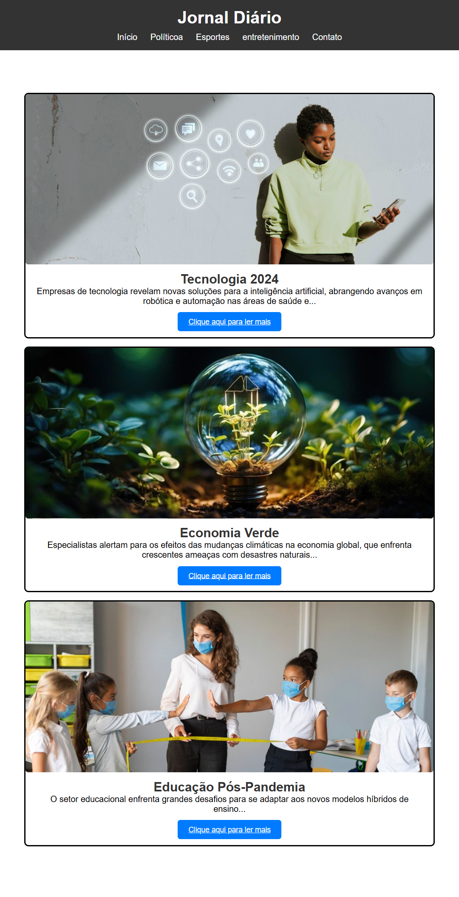

# 🗞️ Meu Jornal Diário

Projeto criado com o objetivo de praticar e entender melhor as propriedades CSS `max-width` e `min-width`. A ideia principal é aprender a definir larguras de forma eficiente e responsiva.

---

## 🔍 Preview do Projeto

---

## 💡 Contribua!

Gostou do projeto? Sinta-se à vontade para fazer melhorias, sugestões ou adaptações. Toda contribuição é muito bem-vinda! 😄

---

## 📄 Licença

Este projeto está licenciado sob a [MIT License](LICENSE).  
Você pode usar, modificar e distribuir à vontade.
